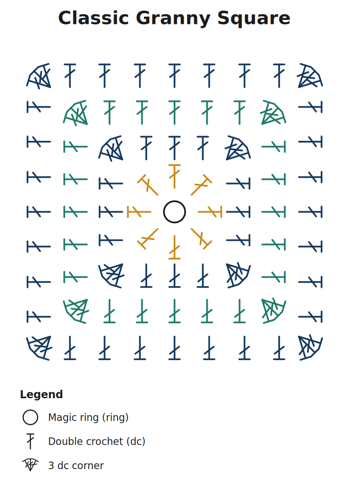
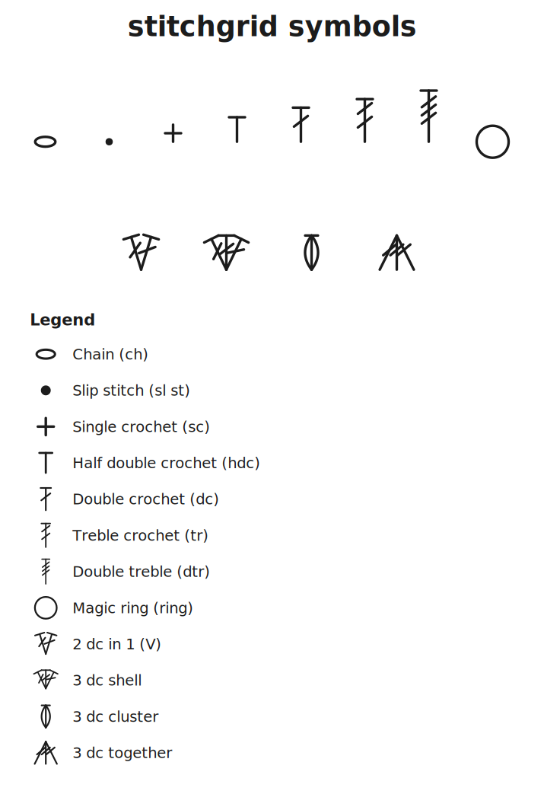

# stitchgrid

A WYSIWYG editor for **crochet granny-square stitch-symbol charts**. Its job is
to produce **high-quality, highly readable pattern images** — the kind of
symbol diagrams you see in pattern books and on craft blogs — while making it
effortless to keep a design perfectly even and symmetrical.



It is a static web app: no build step, no framework, no install. The whole
chart is drawn with SVG, so exports are crisp at any size. (The chart above —
a centre motif, three nested rounds, and colour-matched corner shells — was
generated entirely by the tool; the project file is in `samples/`.)

## Quick start

```bash
node server.js        # zero-dependency static server
# open http://localhost:8080
```

(ES modules are blocked over `file://`, so a local http origin is needed. Any
static server works — e.g. `python3 -m http.server` — `node server.js` just
keeps it dependency-free.)

The app opens on a worked sample so you can see what a clean, symmetric square
looks like. Your work autosaves to the browser and reloads next time; use
**New** to start blank.

## What it does (against the brief)

- **WYSIWYG.** The editor and every export share *one* renderer (`js/svg.js`),
  so the chart you see is exactly the chart you get.
- **Even & symmetrical with ease.** A symmetry engine mirrors your edits live
  (N-fold rotation, optional mirror — default 4-fold for squares): place or
  drag one stitch and its symmetric partners follow. Snapping to concentric
  **rings**, radial **spokes**, or a **square grid** keeps spacing exact, and
  the **Distribute evenly** tool lays a stitch out around a round in one click.
- **Reusable clusters & patterns.** A parametric **cluster editor** builds
  V-stitches, shells, bobbles/puffs and decreases from four parameters (leg
  stitch, count, join top/bottom, fan spread) — define once, reuse across the
  project. Any selection of stitches can also be saved as a **motif** stamp.
- **Highly readable.** Standard symbols (chain = oval, slip stitch = dot,
  sc = cross, hdc = T, dc/tr/dtr = T with 1/2/3 slashes, clusters = joined
  posts). Every symbol is anchored at the exact point it is worked into, and
  fans out from there, so you can always tell where a stitch begins and how it
  lies. An auto-generated **legend** lists every symbol used.



## The model

- **Rounds** are concentric rings worked from a center magic ring outward. They
  double as snapping targets and as the basis for even distribution.
- **Symmetry** is a rotation group (order *N*, optional mirror). Placing a
  stitch creates a linked group that records the symmetry it was made with, so
  editing any member regenerates the orbit and the set stays perfectly
  symmetric even if you change the toolbar afterwards. **Break symmetry**
  detaches a group for free-form work — the "guardrails by default, free when
  needed" hybrid. (Projects saved before this was tracked fall back to the
  current toolbar symmetry the first time such a group is edited.)
- **Snapping** is polar (nearest ring + spoke) or square-grid, with optional
  auto-radial orientation so post stitches point outward like real work.

## Keyboard

| Key | Action |
| --- | --- |
| `V` / `P` / `H` | Select / Place / Pan tool |
| `Space` (hold) | Temporary pan |
| Scroll | Zoom to cursor |
| `R` / `Shift+R` | Rotate selection +/- 15° |
| Arrows (`Shift` = bigger) | Nudge selection |
| `Delete` | Delete selection |
| `Ctrl/Cmd+Z` / `Shift+Z` | Undo / Redo |
| `Ctrl/Cmd+S` | Save project |

## Exporting

- **SVG** — vector master, infinite resolution, editable in Illustrator/Inkscape.
- **PNG** — high-resolution raster (3× by default).
- **Print / PDF** — opens the chart in a print view (Save as PDF).
- **Save / Open** — a `.stitchgrid.json` project file (also autosaved locally).

Two sample projects live in [`samples/`](samples/) — open either from the app:
[`basic-granny.stitchgrid.json`](samples/basic-granny.stitchgrid.json) (the
starter) and [`granny-square.stitchgrid.json`](samples/granny-square.stitchgrid.json)
(the multi-round square shown above).

## Architecture

The core is deliberately **DOM-free and unit-tested**; the UI is a thin layer.

```
js/
  geometry.js   polar/cartesian math, snapping, rigid transforms
  stitches.js   base stitch-symbol library (primitive descriptors)
  clusters.js   parametric cluster generator + presets
  symmetry.js   symmetry-group orbit generation
  rounds.js     rounds model + even-distribution
  svg.js        the one renderer: descriptors -> SVG markup (editor + export)
  state.js      central store: data model, symmetry-aware edits, undo/redo
  canvas.js     interactive surface (pointer, zoom/pan, snap ghost)
  toolbar.js palette.js inspector.js roundsPanel.js legend.js clusterEditor.js
  export.js     SVG / PNG / project / print
  main.js       bootstrap + keyboard + autosave
server.js       zero-dependency static server
```

## Testing

```bash
npm test          # headless tests for the pure core (no dependencies)
npm run test:dom  # boots the app in jsdom (needs: npm install)
```

`test/render-sample.js` regenerates the sample artifacts in `samples/`.

## Roadmap

- **Full-project PDF**: lay out the whole granny-square project (chart +
  legend + written round-by-round instructions) into a ready-to-use,
  print-ready pattern PDF. (The current Print/PDF is a first cut.)
- Symmetry-aware motif stamping; written-instruction generation; multi-square
  blanket layouts.

## License

MIT
